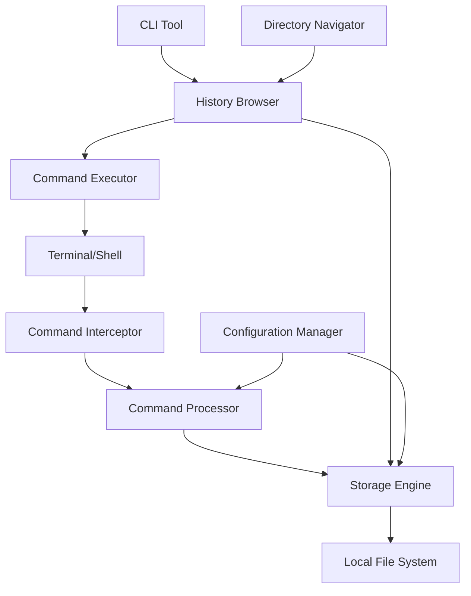

# Design Document

## Overview

The Command History Tracker is a Go package that provides comprehensive terminal command recording and management capabilities. The system consists of three main components: a command interceptor that captures terminal commands, a storage engine that persists command history organized by directory, and an interactive CLI tool for browsing and executing historical commands.

The package is designed to be lightweight, cross-platform, and easily integrable into existing workflows while providing powerful command history management features.

## Architecture

### High-Level Architecture



### Component Interaction Flow

1. **Command Recording Flow**: Terminal → Interceptor → Processor → Storage
2. **History Browsing Flow**: CLI Tool → Browser → Storage → Display
3. **Command Execution Flow**: Browser → Executor → Terminal

## Components and Interfaces

### 1. Command Interceptor

**Purpose**: Capture commands from various shell environments

**Key Interfaces**:
```go
type CommandInterceptor interface {
    StartRecording() error
    StopRecording() error
    SetupShellIntegration(shell ShellType) error
}

type ShellType int
const (
    PowerShell ShellType = iota
    Bash
    Zsh
    Cmd
)
```

**Implementation Strategy**:
- Shell-specific hooks for command capture
- Environment variable injection for shell integration
- Process monitoring for command detection
- Cross-platform compatibility layer

### 2. Storage Engine

**Purpose**: Persist and retrieve command history organized by directory

**Key Interfaces**:
```go
type StorageEngine interface {
    SaveCommand(cmd CommandRecord) error
    GetCommandsByDirectory(dir string) ([]CommandRecord, error)
    GetDirectoriesWithHistory() ([]string, error)
    CleanupOldCommands(retentionDays int) error
}

type CommandRecord struct {
    ID          string
    Command     string
    Directory   string
    Timestamp   time.Time
    Shell       ShellType
    ExitCode    int
    Duration    time.Duration
}
```

**Storage Format**:
- SQLite database for structured queries and performance
- Directory-based indexing for fast lookups
- JSON export/import capabilities for portability

### 3. History Browser

**Purpose**: Interactive interface for command navigation and selection

**Key Interfaces**:
```go
type HistoryBrowser interface {
    ShowDirectoryHistory(dir string) error
    ShowDirectoryTree() error
    SelectCommand() (*CommandRecord, error)
    FilterCommands(pattern string) error
}
```

**UI Features**:
- Terminal-based interactive interface using libraries like bubbletea
- Keyboard navigation (arrow keys, vim-style)
- Search and filtering capabilities
- Multi-column display (command, timestamp, directory)

### 4. Command Executor

**Purpose**: Execute selected commands safely

**Key Interfaces**:
```go
type CommandExecutor interface {
    ExecuteCommand(cmd *CommandRecord, currentDir string) error
    ValidateCommand(cmd *CommandRecord) error
    PreviewCommand(cmd *CommandRecord) string
}
```

**Safety Features**:
- Command validation before execution
- Confirmation prompts for potentially dangerous commands
- Directory context awareness
- Environment variable preservation

## Data Models

### Command Record Schema

```go
type CommandRecord struct {
    ID          string    `json:"id" db:"id"`
    Command     string    `json:"command" db:"command"`
    Directory   string    `json:"directory" db:"directory"`
    Timestamp   time.Time `json:"timestamp" db:"timestamp"`
    Shell       ShellType `json:"shell" db:"shell"`
    ExitCode    int       `json:"exit_code" db:"exit_code"`
    Duration    time.Duration `json:"duration" db:"duration"`
    Tags        []string  `json:"tags" db:"tags"`
}
```

### Configuration Schema

```go
type Config struct {
    StoragePath     string        `json:"storage_path"`
    RetentionDays   int           `json:"retention_days"`
    MaxCommands     int           `json:"max_commands"`
    EnabledShells   []ShellType   `json:"enabled_shells"`
    ExcludePatterns []string      `json:"exclude_patterns"`
    AutoCleanup     bool          `json:"auto_cleanup"`
}
```

### Directory Index

```go
type DirectoryIndex struct {
    Path         string    `json:"path"`
    CommandCount int       `json:"command_count"`
    LastUsed     time.Time `json:"last_used"`
    IsActive     bool      `json:"is_active"`
}
```

## Error Handling

### Error Categories

1. **Storage Errors**: Database connection, file permissions, disk space
2. **Shell Integration Errors**: Unsupported shells, permission issues
3. **Command Execution Errors**: Invalid commands, security restrictions
4. **Configuration Errors**: Invalid settings, missing files

### Error Handling Strategy

```go
type HistoryError struct {
    Type    ErrorType
    Message string
    Cause   error
    Context map[string]interface{}
}

type ErrorType int
const (
    StorageError ErrorType = iota
    ShellError
    ExecutionError
    ConfigError
)
```

**Recovery Mechanisms**:
- Graceful degradation when storage is unavailable
- Fallback to read-only mode for permission issues
- Automatic retry with exponential backoff
- User-friendly error messages with suggested actions

## Testing Strategy

### Unit Testing

- **Component Isolation**: Mock interfaces for each component
- **Storage Testing**: In-memory SQLite for fast tests
- **Shell Integration**: Simulated shell environments
- **Command Execution**: Safe test commands only

### Integration Testing

- **End-to-End Workflows**: Complete command recording and retrieval cycles
- **Cross-Platform Testing**: Windows, macOS, Linux environments
- **Shell Compatibility**: PowerShell, Bash, Zsh, Cmd testing
- **Performance Testing**: Large command history scenarios

### Test Data Management

```go
type TestFixture struct {
    TempDir     string
    TestDB      *sql.DB
    MockShell   *MockShell
    SampleCmds  []CommandRecord
}
```

### Security Testing

- **Command Injection Prevention**: Malicious command handling
- **File Permission Validation**: Storage security
- **Environment Isolation**: Test environment safety
- **Data Sanitization**: Input validation testing

## Performance Considerations

### Storage Optimization

- **Indexing Strategy**: Directory-based and timestamp indexes
- **Batch Operations**: Bulk inserts for better performance
- **Compression**: Command text compression for large histories
- **Cleanup Policies**: Automatic old data removal

### Memory Management

- **Streaming Results**: Large result set handling
- **Connection Pooling**: Database connection management
- **Cache Strategy**: Frequently accessed directory caching
- **Resource Limits**: Configurable memory usage bounds

### Scalability Targets

- Support for 100,000+ commands per directory
- Sub-second response times for history browsing
- Minimal memory footprint (< 50MB typical usage)
- Cross-platform performance consistency